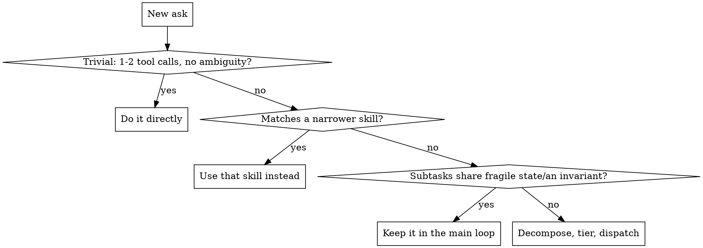

# Decompose and Dispatch

## Overview

A general front door for splitting a non-trivial ask into subtasks and dispatching each to a
subagent on the cheapest model that can actually do it. Most asks either don't need splitting
at all, or already match a more specific skill that knows how to split them well - this skill
is only for what's left over.

## When to Use

**Router - check before inventing a generic split:**

| Ask shape | Use instead |
|---|---|
| Executing an already-written implementation plan | superpowers:subagent-driven-development (requires the `superpowers` plugin) |
| 2+ independent failures/subsystems, no shared state | superpowers:dispatching-parallel-agents (requires the `superpowers` plugin) |
| Open-ended investigative/research question | decomposing-investigations |
| Addressing MR/PR review comments | a repo-specific review-comment-fixing skill, if one exists |

**Don't use when:** the task is trivial; a router row matches; or the remaining subtasks are
tightly coupled (they must agree on the same rule/format/invariant, so independent agents'
judgment calls could quietly drift apart - e.g. client and server validation that must reject
the same inputs the same way). Coupled work stays in one thread even if it touches many files.
A narrow, self-contained side-check inside that work (one lookup, one mechanical test run) can
still be forked off cheaply without breaking that continuity.

## Model Tiering

Same convention as superpowers:subagent-driven-development's Model Selection section:

| Tier | Model | Use for |
|---|---|---|
| Cheapest | haiku | Mechanical: isolated lookups, running lint/tests, applying an already-decided small edit |
| Standard | sonnet | Integration/investigation: multi-file tracing, pattern-matching, debugging, implementing from a clear spec |
| Strongest | opus / main loop | Architecture, design judgment, ambiguous debugging, anything touching an invariant |

**Always state the model explicitly in the dispatch.** An omitted model silently inherits the
session's model - usually the most expensive one - which defeats the tiering.

## Implementation

1. **Bail-out and router checks** above. Either one ends this skill immediately.
2. **Load context** - read the project's `.claude/` docs and any linked cross-repo knowledge
   base (e.g. `../*-knowledge-base/`) before deciding how to split the work. This shapes the
   subtask boundaries and what each dispatch needs to carry.
3. **Decompose** - list subtasks; mark each sequential-dependent or parallel-independent; check
   coupling (see above) and pull anything tightly coupled back into the main loop.
4. **Dispatch** - tier each remaining subtask per the table above. Independent subtasks fire
   together in one message; dependent ones run in sequence, feeding results forward. A subagent
   starts with none of this session's context - quote the relevant KB/`.claude` precedent
   directly into its prompt; don't assume it will rediscover what you already found in step 2.
5. **Integrate** - read each subagent's actual output, not just its summary; verify before
   trusting it; reconcile conflicts between subagents yourself.
6. **Update the knowledge base, if one exists** - a dated entry for anything non-obvious the
   work surfaced, following that KB's own contribution convention. Skip silently if there is
   no such convention; don't invent one.

## Common Mistakes

| Mistake | Fix |
|---|---|
| Forking every subtask reflexively, even tightly-coupled ones | Check coupling first (see flowchart) - coupled work stays in one thread |
| Dispatching without an explicit model | Always state the model; an unstated one defaults to the expensive session model |
| Skipping the router check | A narrower skill already exists for plans/parallel-failures/investigations/MR comments - use it |
| Assuming a subagent shares this session's auto-loaded project context | It doesn't - quote the relevant precedent directly into its dispatch prompt |
